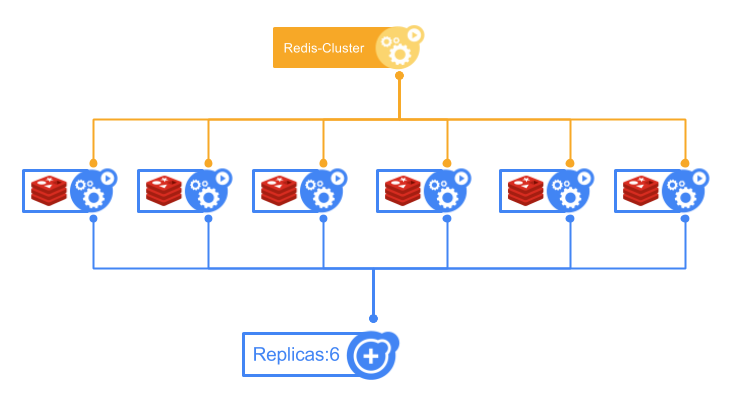

# icm-redis-operator


## Project status: alpha

This is an ongoing project.

The aim of this project is to ease the deployment and operations of a [Redis-cluster](https://redis.io/topics/cluster-tutorial) in a [kubernetes](https://kubernetes.io/) environment. It started internally at Amadeus in 2016, we initially designed this project to run on [Openshift](https://www.openshift.com/). This is the second version of our Redis-Operator that is based now on Kubernetes CustomResourceDefinition (CRD) for representing the RedisCluster configuration.

## Overview

The Redis-cluster will be deployed thanks to a unique deployment. Each node of the icm-redis-cluster is running in its own Pod; At startup, each node has no active role (not replica nor primary with slot), it just joins the cluster as a primary without slot. See representation in the schema below 



At this point you have your redis process running, each node is aware of each other, but only one primary process all slots.

In order to configure properly the different redis-servers and setup the redis cluster, we introduce the `icm-redis-operator`.

The `icm-redis-operator` is watching a new kind of Custom-Resource `RedisCluster` that stores the redis-cluster configuration: number of primaries, and the replication factor (number of replicas by primary) and the pod template. Then `icm-redis-operator` tries to apply this configuration to the set of redis-server processes. If the number of redis-servers doesn't correspond to the provided configuration, the manager scales the redis-node pods to obtain the proper number of redis-nodes.

Then reconciliation is constantly done between the state of the cluster and the configuration stored in the `RedisCluster` CR.

### Development

If you want to take part of the development, you can follow the document: [CONTRIBUTING.md](CONTRIBUTING.md).

## Deployment

you can found checkt the [docs/cookbook.md](docs/cookbook.md) that is a step by step commands cookbook to test/demo the deployment of the operator and a redis-cluster with minikube.

### Deployment environment requirements

As said, the project was initially designed to works on Openshift, but now support also Kubernetes. Please check the minimum environment version in the table below.

| Environment  | Version |
|--------------|---------|
| Openshift    | >= 3.7  |
| Kubernetes   | >= 1.7  |

### Helm deployment

You can found in the `charts` folder two helm charts:

- `icm-redis-operator`: used to deploy the `icm-redis-operator` into your kubernetes cluster.
- `icm-redis-cluster`: used to create a `RedisCluster` custom resource that will be processed by `icm-redis-operator`.

#### Instantiate the `icm-redis-operator`

```console
helm install icm-redis-operator charts/icm-redis-operator
NAME: icm-redis-operator
LAST DEPLOYED: Tue Jan  9 23:41:13 2018
NAMESPACE: default
STATUS: DEPLOYED

RESOURCES:
==> v1/Deployment
NAME                DESIRED  CURRENT  UP-TO-DATE  AVAILABLE  AGE
icm-redis-operator  1        1        1           1          10s
```

TODO: document RBAC support.

#### Create your "RedisCluster"

Using `charts/icm-redis-cluster` you can create a `RedisCluster` Custom Resource which will be processed by the `icm-redis-operator`.

You can configure the Topology of the cluster by providing your own `values.yml` file to helm, or settings the value with the `--set` parameters when you execute `helm install`

```console
helm install icm-redis-cluster charts/icm-redis-cluster
```

> **! Warning !**, if you want to use the docker images corresponding to the level of code present in the "main" branch. You need to set the image tag when you instantiate the icm-redis-cluster chart and the icm-redis-operator chart. The "latest" tag is corresponding to the last validated release.

```console
helm install icm-redis-cluster charts/icm-redis-cluster --set image.tag=main-$COMMIT-dev
```

#### Install the kubectl redis-cluster plugin

docs available [here](docs/kubectl-plugin.md).

### Deployment from source code

#### Build the container images

```console
cd $GOPATH/src/github.com/TheWeatherCompany/icm-redis-operator
make container
```

you can define the docker images tag by adding the variable "VERSION"
```console
make TAG=<Your-TAG> container
```

### How to Release the Redis-Operator

> THIS IS FOR RELEASE INTO ICM REPOS:
>
> Do the following in `main` branch:
> 1. Create a tag on commit
> 2. Push the commit and tag
> 3. ICM automation will build and push docker images and helm charts with git tag version
>
> NOTE: If you need to test the build prior to the above steps, you can run: `make build` and resolve any isssues.

This project is using [goreleaser](https://goreleaser.com/) and an additional script for releasing also the Helm chart.

For starting the delivery, you need to clone this repository, then:

```console
zsh hack/release.sh <version> <remove-git>
```

A concrete example is: ```zsh ./hack/release.sh v1.0.1 upstream```

This script:

- generates locally the helm chart with the requested version.
- updates the helm repo index file (```docs/index.yaml```) file with the new release.
- creates a new changeset with all changes generated by the new release version, then tag this changeset.
- push changeset and associated tag to the remote git repository.
