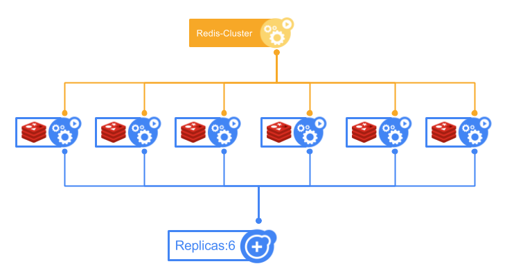

## Project status: alpha

This is an ongoing project.

The goal of this project is to simplify the deployment and management of a [Redis cluster](https://redis.io/topics/cluster-tutorial) in a [Kubernetes](https://kubernetes.io/) environment.
It started internally at Amadeus in 2016, where it was initially designed to run on [Openshift](https://www.openshift.com/).
This is the third version of the Redis operator, which leverages the [Operator SDK](https://sdk.operatorframework.io/) framework for operators.

## Overview

This project contains two Helm charts, namely `icm-redis-operator` and `icm-redis-cluster`. The first chart deploys the Redis operator, `RedisCluster` Custom Resource Definition (CRD), and various other k8s resources.
The second chart deploys the `RedisCluster` resource and various other k8s resources. Each node in the Redis cluster runs in its own Pod.
Upon startup, each node joins the cluster as a primary node with no slots. See the cluster representation in the diagram below:



At this point, your Redis process running and each node is aware of each other, but only one primary has all the slots.
In order to properly configure each node in the cluster, we introduce the `Redis Operator`.

The `Redis Operator` watches the `RedisCluster` CR that stores cluster configuration: number of primaries, replication factor (number of replicas per primary), and the pod template.
Then the operator tries to apply this configuration to the set of Redis server processes. If the number of Redis servers doesn't match the provided configuration, the manager scales the number of pods to obtain the proper number of Redis nodes.
The operator continuously reconciles the state of the cluster with the configuration stored in the `RedisCluster` CR until they match. To understand how the reconciliation loop works, see the [Operator SDK docs](https://sdk.operatorframework.io/docs/building-operators/golang/tutorial/#reconcile-loop).

## Deployment

You can follow the [cookbook](cookbook.md) to deploy the operator and Redis cluster with Minikube.

### Environment requirements

The project may have started on Openshift, but it now supports Kubernetes as well. Please check the minimum environment version in the table below.

| Environment  | Version |
|--------------|---------|
| Openshift    | >= 3.7  |
| Kubernetes   | >= 1.7  |

### Helm chart deployment

You can find two Helm charts in the `charts` folder:

- `icm-redis-operator` used to deploy the operator in your Kubernetes cluster.
- `icm-redis-cluster` used to create the `RedisCluster` CR that will be managed by the operator.

Operator deployment example:
```console
helm install icm-redis-operator charts/icm-redis-operator
NAME: icm-redis-operator
LAST DEPLOYED: Fri Aug 13 11:48:29 2021
NAMESPACE: default
STATUS: deployed

RESOURCES:
==> v1/Deployment
NAME                DESIRED  CURRENT  UP-TO-DATE  AVAILABLE  AGE
icm-redis-operator  1        1        1           1          10s
```

#### Create the RedisCluster

You can configure the topology of the cluster by editing the provided `values.yaml`, using an override file, and/or setting each value with `--set` when you execute `helm install`.

Redis cluster deployment example:
```console
helm install icm-redis-cluster charts/icm-redis-cluster
NAME: icm-redis-cluster
LAST DEPLOYED: Fri Aug 13 11:48:29 2021
NAMESPACE: default
STATUS: deployed
REVISION: 1
TEST SUITE: None
```

> **! Warning !**, if you want to use the docker images corresponding to the level of code present in the "main" branch. You need to set the image tag when you instantiate the icm-redis-cluster chart and the icm-redis-operator chart. The "latest" tag is corresponding to the last validated release.

```console
helm install icm-redis-cluster charts/icm-redis-cluster --set image.tag=main-$COMMIT-dev
```

### Install kubectl redis-cluster plugin

Docs available [here](kubectl-plugin.md).

### Deployment from source code

#### Build container images

```console
cd $GOPATH/src/github.com/TheWeatherCompany/icm-redis-operator
make container
```

you can define the docker images tag by adding the variable "VERSION"
```console
make TAG=<Your-TAG> container
```

### How to Release the Redis Operator

> THIS IS FOR RELEASE INTO ICM REPOS:
>
> Do the following in `main` branch:
> 1. Create a tag on commit
> 2. Push the commit and tag
> 3. ICM automation will build and push docker images and helm charts with git tag version
>
> NOTE: If you need to test the build prior to the above steps, you can run: `make build` and resolve any issues.
